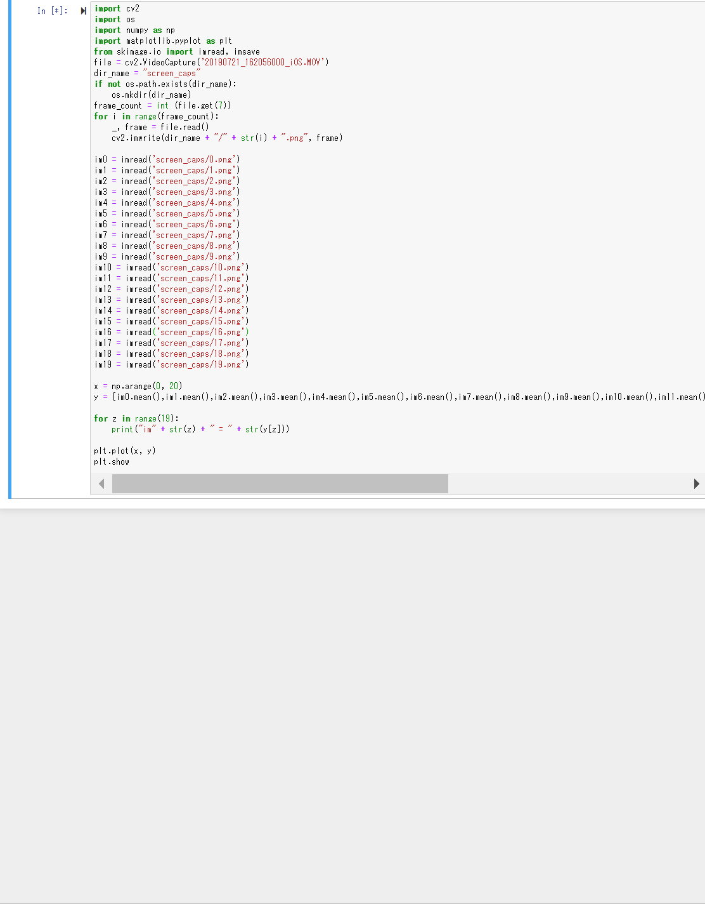

import cv2
import os
import numpy as np
import matplotlib.pyplot as plt
from skimage.io import imread, imsave
file = cv2.VideoCapture('20190721_162056000_iOS.MOV')
dir_name = "screen_caps"
if not os.path.exists(dir_name):
    os.mkdir(dir_name)
frame_count = int (file.get(7))
for i in range(frame_count):
    _, frame = file.read()
    cv2.imwrite(dir_name + "/" + str(i) + ".png", frame)
    
im0 = imread('screen_caps/0.png')
im1 = imread('screen_caps/1.png')
im2 = imread('screen_caps/2.png')
im3 = imread('screen_caps/3.png')
im4 = imread('screen_caps/4.png')
im5 = imread('screen_caps/5.png')
im6 = imread('screen_caps/6.png')
im7 = imread('screen_caps/7.png')
im8 = imread('screen_caps/8.png')
im9 = imread('screen_caps/9.png')
im10 = imread('screen_caps/10.png')
im11 = imread('screen_caps/11.png')
im12 = imread('screen_caps/12.png')
im13 = imread('screen_caps/13.png')
im14 = imread('screen_caps/14.png')
im15 = imread('screen_caps/15.png')
im16 = imread('screen_caps/16.png')
im17 = imread('screen_caps/17.png')
im18 = imread('screen_caps/18.png')
im19 = imread('screen_caps/19.png')

x = np.arange(0, 20)
y = [im0.mean(),im1.mean(),im2.mean(),im3.mean(),im4.mean(),im5.mean(),im6.mean(),im7.mean(),im8.mean(),im9.mean(),im10.mean(),im11.mean(),im12.mean(),im13.mean(),im14.mean(),im15.mean(),im16.mean(),im17.mean(),im18.mean(),im19.mean(),]

for z in range(19):
    print("im" + str(z) + " = " + str(y[z]))

plt.plot(x, y)
plt.show

[説明]
環境構築を行い、撮影した動画を取り込みフレーム毎に分けその分けたフレームを変数に格納し輝度の平均を求めた。

[使い方・実行の仕方・依存ライブラリとバージョン]
Ctrl+Enterで実行を行った

numpy-base                1.16.4           py37hc3f5095_0
matplotlib                3.1.0            py37hc8f65d3_0

[参考サイト]
https://note.nkmk.me/python-opencv-video-to-still-image/
ページ内のコードを参考

